# Instructions:
- There are 14 errors in this app.
- Do not think you can copy your old app over to the new.
- They do not match.
- Controllers have been included and other changes have been made. So read the code.
- Test to make sure each controller, model, view, router, and file is working using PostMan, Robo 3T and the Browser
- Make a corrected.md file and write each error that you corrected and how you corrected it.
  

node module  
bin www file  
packagelock.json  
index  
user  
<hr>
<hr>
<hr>
<hr>

## 1st error:- `ReferenceError: mongoose is not defined`
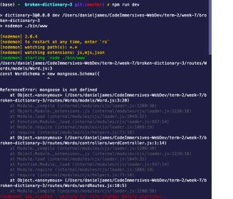


## 1st fix : `require mongoose in Word.js file`
```javascript
const mongoose = require('mongoose')
```
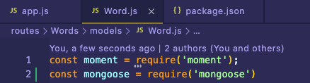  

<hr>
<hr>
<hr>
<hr>

## Error 2: `TypeError: Cannot read property 'push' of undefined`

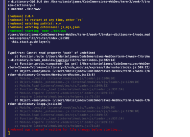


## Fixed 2: `Router to Router()` in wordRoutes.js
```javascript
const router = require('express').Router();
```
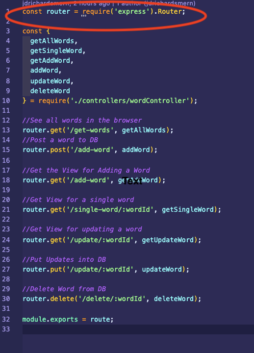

<hr>
<hr>
<hr>
<hr>

## Error 3: `ReferenceError: getUpdateWord is not defined`
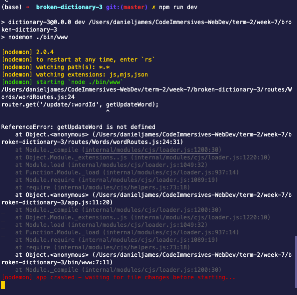


## Fixed 3: include `getUpdateWord` in `require('./controllers/wordController');`  

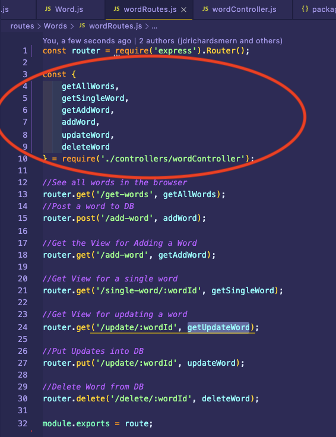  
<hr>
<hr>
<hr>
<hr>


## Error 4: `ReferenceError: route is not defined`

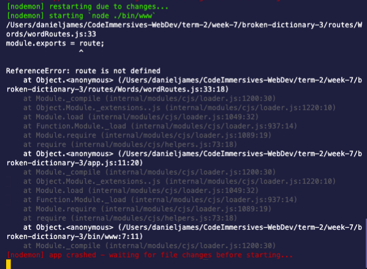

## Fixed 4: `r` was left out in `router`
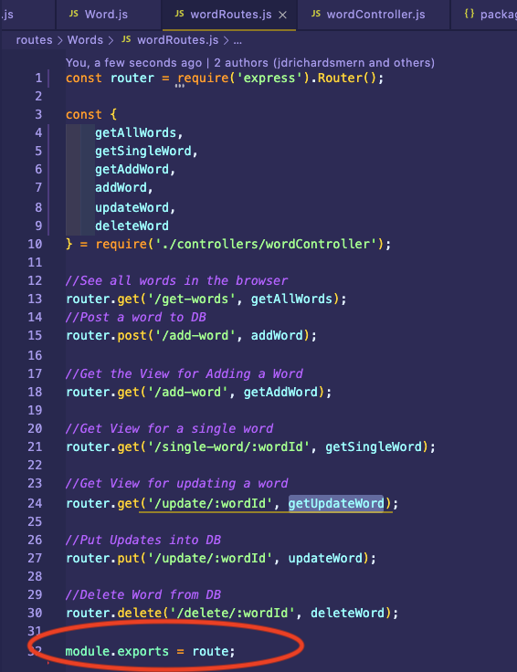

<hr>
<hr>
<hr>
<hr>


## Error 5: `ReferenceError: env is not defined`
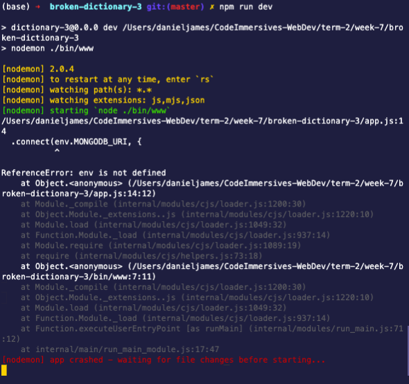


## Fixed 5 : should be `process.env.MONGODB_URI`
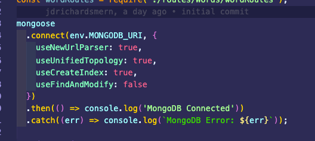

<hr>
<hr>
<hr>
<hr>
<hr>

## Error 6: `ReferenceError: app is not defined`  

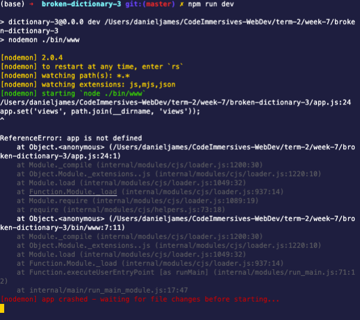

## Fixed 6: define `app` using `express()` 

needs:
```javascript
const app = express();
```
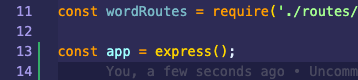

## Error 7: `ReferenceError: wordRouter is not defined`

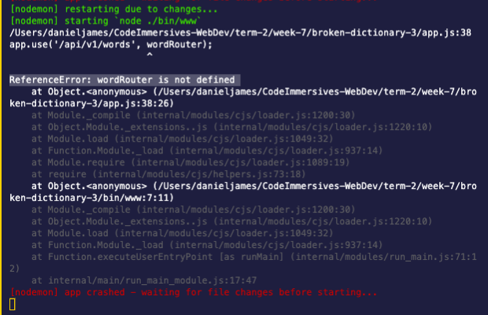

## Fixed 7: misspelled WorRouter change `wordRoutes` to `wordRouter`

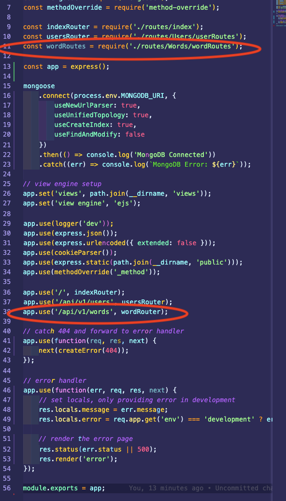  
<hr>
<hr>
<hr>
<hr>
<hr>
<hr>

## Error 8: ` MongooseError: The `uri` parameter to `openUri()` must be a string, got "undefined"`

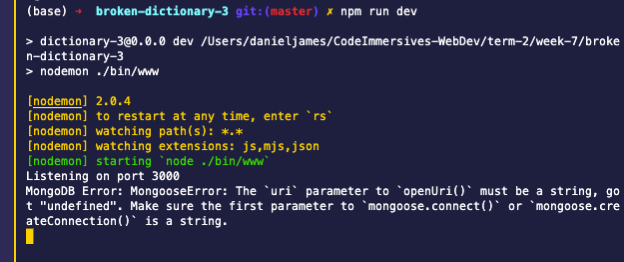


## Fixed 8: include `MONGODB_URI=mongodb://localhost/broken-dictionary-3` string in `.env` file  

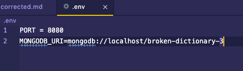  

## and require it in the app.js file
```javascript
require('dotenv').config();
```

<hr>
<hr>
<hr>
<hr>
<hr>
<hr>

## Error 9: `getAllWords` `wordController.js`
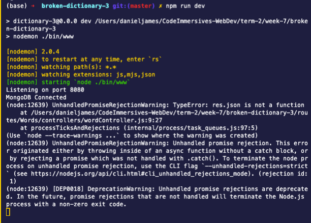


## Fixed 9: req mistakenly defined in res' space

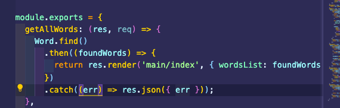

```javascript
  getAllWords: (res, req) => {}
```
should be:

```javascript
  getAllWords: (req, res) => {}
```

